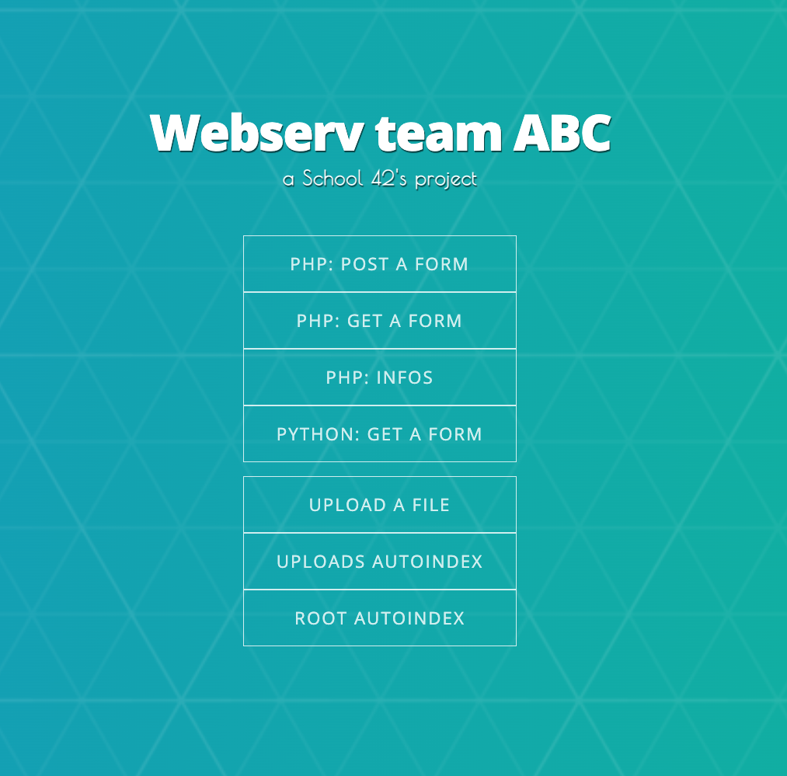

# WEBSERV

## Team

#### [Ovoda](https://github.com/Ovoda): network/sockets manager, CGI
#### [Agogibus](https://github.com/agogibus): request and config file parser
#### [bvalette](https://github.com/42f): HTTP methods, responses manager

## Project

This is a Écle 42's project.
This project implements a simple web server based on HTTP/1.1 protocol. It implements Get, Post and Delete methods. So it can serve static web pages, dynamic pages thanks to customizable CGI (PHP, python...).
It is fully configurable though a config file, inspired by Nginx format.

## Building

``$> git clone git@github.com:42f/WEBSERV.git ``

``$> cd WEBSERV``

To use launch webserv with the default configuration file and setup minimanl demo files in `/tmp`:

``$> make && ./assets/setup_files.sh && ./webserv``

This will serve a demo page on `http://localhost:18000`

